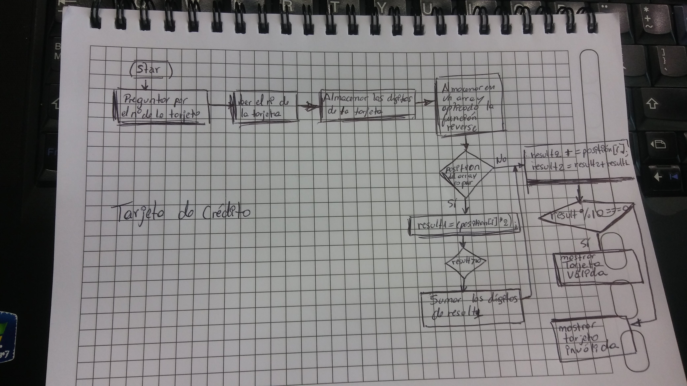

# TARJETA DE CRÉDITO

### Esto es la solución de la tarjeta de crédito

Se creo variables para la solución:

* numReverse : para almacenar el numero de manera reversa

* tarj : Sirve para almacenar loS digitos d ela tarjeta

* array: Sirve para guardar en un arreglo los digitos

to do:

1. Preguntar el  numero de la tarjeta

2. Pasar los números en un array en orden inverso

3. Aplicar la operación a los números de las posiciones pares

4. Sumar los digitos y nuevos digitos.

5. Comprobar si es una tarjeta válida

**Proceso --- (Tips)**

> 1. Agregar los números d ela tarjeta a un array en orden inverso.
> 2. A todos los números  que ocupan las posiciones pares se les debe multiplicar por 2 y si el doble de ese numero es mayor o igual a 10 debemos de sumar los dígitos del resultado.
> 3. Ahora deberas sumar  los números de las posiciones impares y el nuevo numero que se obtendra de las posiciones pares.
> 4. Cuando ya se tiene el resultado deberas obtener el residuo de la división entre 10 y si es igual a 0 significa que la tarjeta de crédito es válida.

